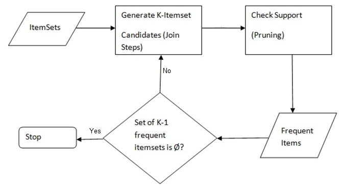
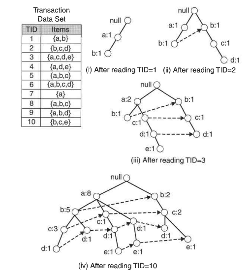

# Association Rules

Apriori is an algorithm for frequent item set mining and association rule learning over transactional databases. The algorithm identifies the frequent individual items in the database and, as long as those itemsets appear sufficiently often in the database, extends them to larger itemsets. The frequent itemsets determined by Apriori can be used to determine association rules which highlight general trends in the database.

## 1. Market Basket Analysis

### Support

The support of an itemset 𝑋, 𝑠𝑢𝑝𝑝(𝑋) is the proportion of transaction in the database in which the item X appears. It signifies the popularity of an itemset.

$$ 𝑠𝑢𝑝𝑝(𝑋) = Number of transaction in which 𝑋 appears / Total number of transactions $$

If the sales of a particular product (item) above a certain proportion have a meaningful effect on profits, that proportion can be considered as the support threshold. Furthermore, we can identify itemsets that have support values beyond this threshold as significant itemsets.

### Confidence

$$ conf(X \rightarrow Y) = \frac{supp(X \cup Y)}{supp(X)} $$

## 2. The Apriori Algorithm

Principles:

1. If an itemset is frequent, then all of its subsets must also be frequent.
2. Similarly, for any infrequent itemset, all its supersets must be infrequent too

Example: If *{beer, diaper, oreos}* is frequent, so is *{beer, diaper}* since every transaction having the first also contains the latter.

$$ \forall X, Y: (X \subseteq Y) \Rightarrow s(X) \geq s(Y) $$

* The support of an itemset never exceeds that of its subsets
* This is known as the **anti-monotone** property of support.

### Pseudocode for Apriori Algorithm

* Iteratively generate candidates with length *k+1* from frequent itemsets with length *k*
* Check candidate's for minimum support
* Update k and repeat until the set of k-1 frequent itemsets is empty.

## Mining Association Rules

Two-step approach:

* **Step 1**: Frequent itemset generation: Generate all item sets whose support >= minsup
* **Step 2**: Rule generation: Generate high confidence (strong) rules from each frequent itemset (called *candidate rule*)

## Cons of the Apriori Algorithm

* Sometimes, it may need to find a large number of candidate rules which can be computationally expensive.
* Calculating support is also expensive because it has to go through the entire database.

## 3. FP-Growth

* Reduce the number of comparisons by using tree data structure to store the candidate itemsets or to compress the dataset.

### FP-Tree

* An FP-Tree is a compressed representation of the input data.
* It is constructed by reading the dataset one transaction at a time and mapping each transaction onto a path in the FP-Tree structure.

